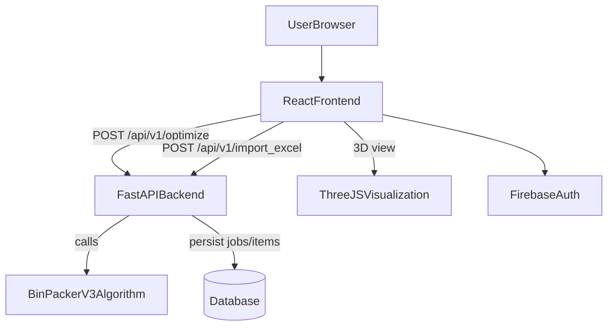

# BinPacker Cloud App — Full Project Overview (for AI-LLM)

This document explains the **entire BinPacker Cloud App** end-to-end (frontend, backend, algorithm, database, and deployment). It is written as context for an AI system that will help develop/extend the project.

---

### 1) What this project is

**BinPacker Cloud App** is a cloud-deployed application for **3D bin packing optimization** focused on **logistics truck loading**. The main goal is to pack cargo items into a truck/container volume while respecting practical constraints such as:

- 3D geometry (collision-free placement)
- Stability/support constraints (e.g., “100% support” requirement mentioned in docs)
- Rotation rules (palletized-like rotation: swap length/width, keep height orientation)
- Weight tracking and distribution considerations
- Route/destination fields for real logistics workflows

The application provides:

- A **React + TypeScript frontend** with **Three.js** visualization
- A **FastAPI backend** exposing optimization + import endpoints
- A **core algorithm module** implementing an improved “collision points” approach
- Database models/schema for persisting jobs/items/vehicles (Postgres schema provided; local dev uses SQLite by default)
- Container and Cloud Run deployment artifacts

Primary repo docs: `README.md`

---

### 2) Repository structure (high level)

- **Backend (Python/FastAPI)**: `src/api/main.py`
- **Algorithm (Python)**: `src/algorithm/bin_packer_v3.py`
- **Database models (SQLAlchemy)**: `src/models/models.py`
- **DB schema (Postgres)**: `database_schema.sql`
- **Frontend (React/TypeScript)**: `frontend/`
  - App root: `frontend/src/App.tsx`
  - Landing/auth: `frontend/src/components/LandingPage.tsx`
  - Main optimizer UI: `frontend/src/components/BinPackerAlgorithm.tsx`
  - 3D visualization: `frontend/src/components/TruckVisualization.tsx`
  - Excel import UI: `frontend/src/components/ExcelImport.tsx`
  - Firebase auth context: `frontend/src/contexts/AuthContext.tsx`
  - Firebase client config: `frontend/src/firebase/config.ts`
- **Local containers**: `docker-compose.yml`, `Dockerfile`, `frontend/Dockerfile`, `frontend/nginx.conf`
- **GCP CI/CD**: `cloudbuild.yaml`

---

### 3) Architecture (system-level)

**Key idea**: the frontend is a “thin client” that gathers truck + item inputs, calls the backend optimization endpoint, then renders results + a 3D visualization of placements.

---

### 4) Frontend (React + TypeScript)

#### 4.1 App entry and routing

`frontend/src/App.tsx` drives the basic navigation:

- Uses `AuthProvider` (`frontend/src/contexts/AuthContext.tsx`) to track Firebase auth state.
- Shows `LandingPage` when:
  - user is not logged in, or
  - user navigates back to landing state
- Shows `BinPackerAlgorithm` when user is logged in and chooses to proceed.

There is no URL-based routing for landing vs optimizer in the current implementation; it is state-driven in `App.tsx`.

#### 4.2 Authentication

Client-side auth is Firebase:

- Auth context: `frontend/src/contexts/AuthContext.tsx`
  - listens to `onAuthStateChanged(auth, ...)`
  - exposes `{ user, loading }`
- Firebase init: `frontend/src/firebase/config.ts`
  - reads `REACT_APP_FIREBASE_*` environment variables
  - falls back to hard-coded demo values
  - logs config to console (debug-heavy)

Landing/auth UI: `frontend/src/components/LandingPage.tsx`

- Supports:
  - Google popup sign-in (`signInWithPopup` + `GoogleAuthProvider`)
  - Email/password login (`signInWithEmailAndPassword`)
  - Email/password registration (`createUserWithEmailAndPassword`)
  - Sign-out (`signOut`)
- After successful auth, calls `onLoginSuccess()` which switches `App.tsx` to the optimizer page.

Firebase setup doc: `frontend/FIREBASE_SETUP.md`

#### 4.3 Optimizer UI & API calls

Main UI: `frontend/src/components/BinPackerAlgorithm.tsx`

- Maintains state for:
  - truck dimensions (defaults to EU-like: 13.62m x 2.48m x 2.7m)
  - items array (manually added and/or Excel imported)
  - selected route filter
  - optimization result object returned by the backend
- Calls backend endpoint:
  - `POST ${REACT_APP_API_BASE_URL || 'http://localhost:8000'}/api/v1/optimize`
- Sends payload shape:
  - `truck`: { length, width, height }
  - `items`: item objects with stackability normalized to `stackable | semi_stackable | unstackable`, and route/destination fields aligned

#### 4.4 3D visualization

`frontend/src/components/TruckVisualization.tsx` renders placed items in 3D using:

- `@react-three/fiber` and `three`
- `OrbitControls` for navigation
- Item boxes are rendered with:
  - computed Three.js coordinates derived from the backend-provided `position` + `dimensions`
  - hover effects and optional labels

#### 4.5 Excel import (frontend)

`frontend/src/components/ExcelImport.tsx` implements **client-side Excel parsing** via `xlsx`:

- Upload `.xlsx/.xls/.csv`
- Map columns to required fields: `length`, `width`, `height`, `weight`
- Optional mapping: `stackability`, `route`, `priority`, `notes`, `duplicate`
- Reads the first sheet and converts it into structured item objects
- Passes imported items back to parent via `onImport(processedData, mapping)`

Note: the backend also exposes an Excel import endpoint (see backend section). The frontend’s current Excel import approach is “parse in browser, then send items for optimization”.

---

### 5) Backend (FastAPI)

Main application: `src/api/main.py`

#### 5.1 Core endpoints

- `GET /` returns basic API metadata
- `GET /api/v1/health` returns health info
- `POST /api/v1/optimize` runs the bin packing algorithm
- `POST /api/v1/import_excel` imports a spreadsheet into a persisted packing job (creates job + items)
- `GET /api/v1/statistics` returns usage stats (optimizations processed, avg time, etc.)

#### 5.2 Optimization request and response

`POST /api/v1/optimize` accepts:

- `truck`: dimensions in meters
- `items`: list of items with dimensions in meters, weight in kg, plus:
  - `destination`, `route`, `priority`
  - `stackability` (`stackable | semi_stackable | unstackable`)

The backend converts request items into algorithm `Item` objects (`algorithm.bin_packer_v3.Item`) and runs:

- `BinPackerV3(truck_length, truck_width, truck_height)`
- `packer.pack_items(algorithm_items)`

Response includes:

- `efficiency`, `total_weight`, truck dimensions
- `placed_items`: each has id, route/priority/stackability (if present), position, rotation, dimensions, weight
- `unplaced_items` + stats
- `execution_time`, timestamp

#### 5.3 Job-based workflow (optional)

The optimize endpoint supports an optional `job_id` mode:

- If `job_id` is provided, the backend loads items for that job from DB (`PackingJob` + `PackingJobItem`)
- If truck dims are not provided, it uses a default vehicle (`create_default_vehicle()`) stored in DB
- After optimization, it persists results back into the job record (`result_data`, counters, timestamps)

#### 5.4 Excel import endpoint (backend)

`POST /api/v1/import_excel`

- Reads uploaded Excel via `pandas.read_excel`
- Creates a new `PackingJob`
- Inserts `Item` rows and `PackingJobItem` rows
- Expects columns (per docstring): length/width/height/weight (+ optional destination/quantity/stackability)
- Converts meters → millimeters for DB storage

---

### 6) Algorithm module (BinPackerV3)

Main module: `src/algorithm/bin_packer_v3.py`

Key concepts visible in the module:

- `Item`: length/width/height/weight, route/destination/priority, stackability
- Rotation policy: `Item.get_rotations()` swaps length/width only and keeps height fixed (pallet-style)
- Enumerations:
  - `ConstraintType`: GEOMETRIC, COLLISION, SUPPORT, WEIGHT, ROTATION
  - `Stackability`: STACKABLE, SEMI_STACKABLE, UNSTACKABLE
- Uses a “collision points” approach (see README description) to select feasible placements

The algorithm returns a structured result dict used directly by the API response builder.

---

### 7) Database layer

#### 7.1 ORM models

`src/models/models.py` defines SQLAlchemy models for:

- `Vehicle`
- `Item`
- `PackingJob`
- `PackingJobItem`
- `PlacedItem`
- `User`, `UserPackingJob`
- `AlgorithmConfiguration`
- `SystemLog`

Helper factories:

- `create_default_vehicle()`
- `create_default_algorithm_config()`

#### 7.2 SQL schema (Postgres)

`database_schema.sql` provides a Postgres-compatible schema including:

- tables for vehicles/items/users/jobs/job_items/placed_items/logs
- indexes and triggers for `updated_at`
- default seed rows:
  - default EU vehicle (“EU Euroliner”)
  - default algorithm configuration

#### 7.3 Important note on current DB configuration

`src/api/main.py` currently creates an engine using a fixed SQLite URL:

- `DATABASE_URL = "sqlite:///./local.db"`

However `docker-compose.yml` sets `DATABASE_URL=postgresql://...` for the backend container.

If you want backend containers to use Postgres in docker-compose, the backend will need to read `DATABASE_URL` from environment rather than hardcoding SQLite.

---

### 8) Deployment & operations

#### 8.1 Local development (Docker Compose)

`docker-compose.yml` defines:

- `backend` (FastAPI) exposed on `8000`
- `frontend` built from `frontend/` served via nginx
- `postgres` for DB
- optional `pgadmin` profile
- `redis` placeholder for future caching

#### 8.2 Backend container

`Dockerfile` (backend):

- Base: `python:3.11-slim`
- Installs deps from `requirements.txt`
- Runs: `uvicorn src.api.main:app --host 0.0.0.0 --port 8000`

Note: Dockerfile defines a healthcheck using `curl`, but `curl` is not installed in the image (only `gcc` is installed). For a reliable healthcheck, the image should include curl or use a Python-based healthcheck.

#### 8.3 Frontend container

`frontend/Dockerfile`:

- Build step: Node 16 + CRA build
- Runtime step: nginx serving the static build
- Injects `REACT_APP_API_BASE_URL` at build time (Cloud Build uses this)

`frontend/nginx.conf` listens on port `8080`.

Important: `frontend/Dockerfile` exposes `80` by default, and `docker-compose.yml` maps `3000:80`. If nginx is configured to listen on `8080`, docker-compose may need to map `3000:8080` (or nginx conf updated to listen on `80`).

#### 8.4 Cloud Build + Cloud Run

`cloudbuild.yaml`:

- Runs backend tests (pytest; errors ignored via `|| true`)
- Builds backend image and frontend image
- Deploys both to Cloud Run (region `europe-west1`)
- Frontend build receives `REACT_APP_API_BASE_URL` pointing to the deployed backend URL

---

### 9) Configuration & environment variables

#### 9.1 Frontend env vars

- `REACT_APP_API_BASE_URL`
  - Used by optimizer UI to target backend in local/dev/prod environments
- Firebase (from `frontend/FIREBASE_SETUP.md`):
  - `REACT_APP_FIREBASE_API_KEY`
  - `REACT_APP_FIREBASE_AUTH_DOMAIN`
  - `REACT_APP_FIREBASE_PROJECT_ID`
  - plus optional sender/app IDs (supported in `frontend/src/firebase/config.ts`)

#### 9.2 Backend env vars (intended)

Docker compose provides:

- `DATABASE_URL` (Postgres)
- `ENV`, `DEBUG`

But note: current backend code hardcodes SQLite. If switching to Postgres, implement `DATABASE_URL = os.getenv("DATABASE_URL", "sqlite:///./local.db")`.

---

### 10) Primary user flows (end-to-end)

#### Flow A: Authenticate and run optimization (most common)

1. User opens frontend landing page
2. User authenticates via Firebase (Google or email/password)
3. Frontend shows optimizer UI
4. User defines truck dimensions + adds items (manual or Excel import)
5. Frontend calls backend `POST /api/v1/optimize`
6. Backend runs `BinPackerV3.pack_items(...)`
7. Backend returns placed/unplaced items + metrics
8. Frontend displays results + 3D visualization

#### Flow B: Import Excel into a persisted job (backend-managed)

1. Client uploads spreadsheet to `POST /api/v1/import_excel`
2. Backend creates `PackingJob` + inserts items
3. Backend returns `job_id`
4. Client can call `POST /api/v1/optimize` with `job_id` to optimize using persisted items
5. Backend persists results into `packing_jobs.result_data`

---

### 11) Known mismatches / tech debt (helpful for an AI to know)

- **DB configuration mismatch**: backend uses SQLite hardcoded, docker-compose expects Postgres via `DATABASE_URL`.
- **nginx port mismatch risk**: nginx conf listens `8080`, but containers/compose expose/map `80`.
- **Healthcheck mismatch risk**: backend Dockerfile uses curl in healthcheck, but curl is not installed.
- **Debug logging**: some frontend components log heavily to console (useful for dev, noisy for prod).

These aren’t fatal to understanding the project, but they matter when running in containers or deploying.

---

### 12) What an AI should assume when extending this project

- Preserve request/response shapes for `/api/v1/optimize` because the frontend expects them.
- Keep units consistent:
  - Frontend/UI uses meters and kg for optimization
  - DB schema stores dimensions in millimeters and weight in kg
- Keep the rotation assumption consistent (swap length/width, keep height fixed) unless you redesign both algorithm + UI.
- Authentication is currently **frontend-only** (Firebase client auth). If you need backend authorization, you’ll likely add Firebase Admin token verification in the backend.

